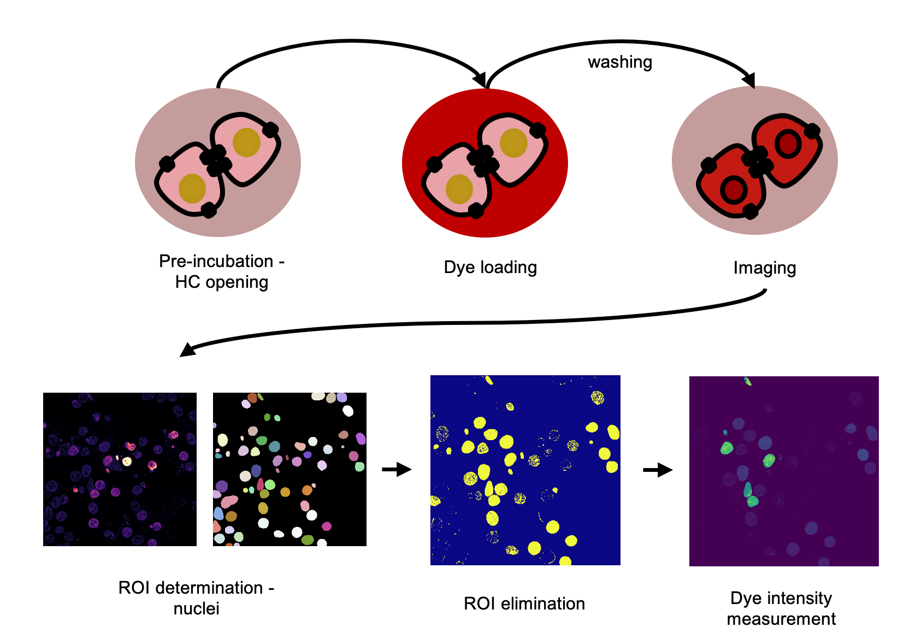

## Overview

The script was generated for procesing of connexin HC dye uptake fluorescent microscopy data, in which each field of view contains three images collected by three different dye channels: a nuclear channel, a YFP channel (indicator channel) and a connexin-permeable dye channel. 
- The nuclei serve as regions of interest (ROIs), 
- YFP channel as an indicator of the target cells, which contain the connexin (indicaator chaannel),
- SR101 (connexin-permeable dye) channel as an indicator of connexin function and the channel, from which the measurement is taken from (measurement channel). 

The script is useful for all other purposes, in which the measurement is taken in the nucleus region of the cell from a non-nucleus channel (measurement channel), in which only a subset of nuclei are of interest, based on an indicator channel. 

The script contains the following processing steps:

a. Pre-processing (scaling of all images to the size of the model (360x360 pix) and normalization of the nucleus channel);

b. Segmentation of the nuclei and generation of a mask covering the nuclei ROIs;

c. Elimination of nuclei ROIs, which are not of interest (signal in indicator channel is below threshold);

b. Measurement of signal from measurement channel, from final ROIs.



## Setup

1. Create a virtual environment and activate it

```sh
python3 -m venv env
source env/bin/activate
```

Then install the requirements by

```sh
pip install -r requirements.txt
```

2. In main.py modify MODEL (if necessary), PATH_TO_DATA and NAME. 

```python
MODEL = '2D_versatile_fluo'
PATH_TO_DATA = 'Path/To/Dataset' #ENDS NOT WITH A SLASH
name = 'Name' #Name of the experiment
```

- The model can be personal or selected from Stardist presets, depending on which segments the nuclear channel best. [Stardist GitHub](https://github.com/stardist/stardist)
- The path to data has to contain all channels of an image in the same folder (nuclear stain channel - ch00, channel indicative of target presence - ch01, and measurement channel - ch02).

4. Modify THRESHOLD to fit the data. The value of the threshold, should be set to eliminate background.

```python
THRESHOLD = 1000 #Modify based on experimental data
```

5. Run the script

```sh
python3 main.py
```

## Exporting results

All results are saved in a new `Results` folder, generated in your provided data directory. 

1. In the Results folder, three separate directories are generated, namely `ROI` `Measurement_data` and `Results_ic`. It also contains all pre-processed images prior to segmentation.
2. ROI folder contains all regions of interest per image generated during segmentation as a Fiji ([ImageJ](https://imagej.net/software/fiji/)) compatible file. 
3. The Measurement_data folder contains all measurements in a .csv files. There is a .csv file generated for each individual image (Measurements_ic#.csv) as well as a file, which contains measurements from all images (Measurements_merged_ic.csv). In the individual image measurement files, the column A lists the nr. of the measurement, column B measurement value and column C the coordinate center of the region from which the measurement has been collected from. The merged file contains in addition a column D, which represents the image nr.
4. The Results_ic folder contains all images generated from segmentation onwards. 
5. A .docx file is generated containing all information of the processing and allows a quick look through the intermediate results to evaluate the processing of the data. 

The results are overwritten after each new run, if the results of the previous run are not renamed or saved elsewhere. 

## Google colab

The code is also available on Google colab and useful in conjunction with data, saved on a personal Google Drive account. To use the colab notebook, click `File` --> `Save a copy in Drive`. 

[Google Colab HC data analysis notebook](https://colab.research.google.com/drive/12-i2viK8jNutXvDpBZqbASo8lOzWmQr3?usp=sharing)

The Colab notebook allows an interactive processing, together with GPU acceleration, if this is not available on a personal workstation. 

## Data type

The data, on which the script has been tested, has been collected using Leica STELLARIS 5 confocal microscope at a 63 X magnification (1.4 NA), 527 x 527 pix, 16-bit, 1AU